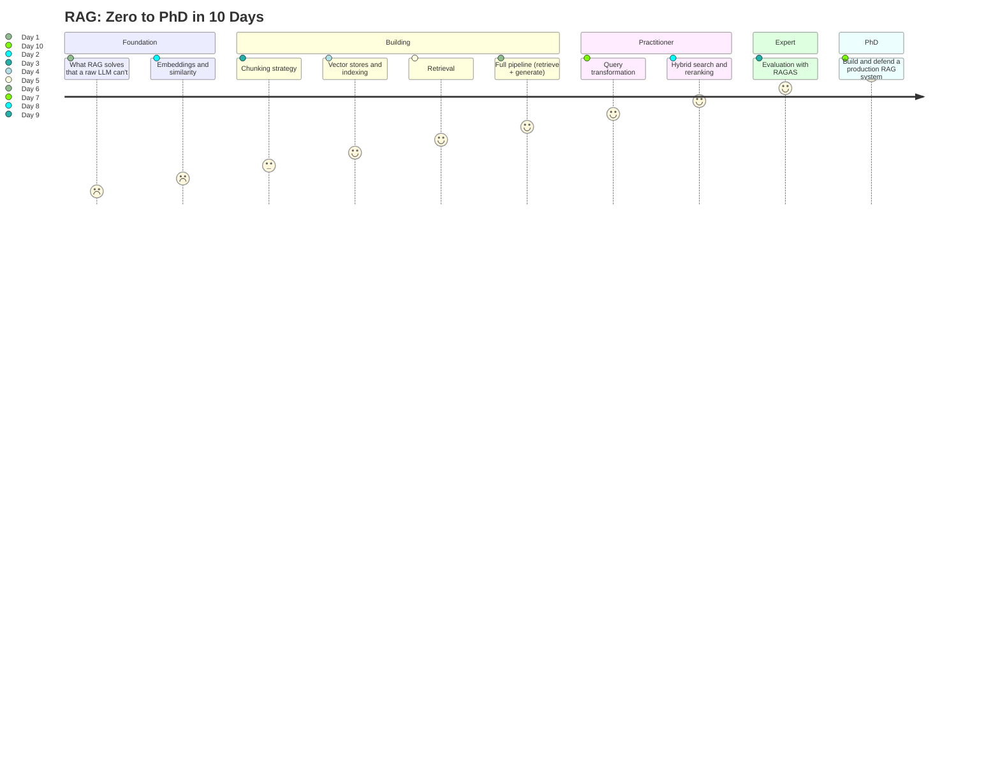
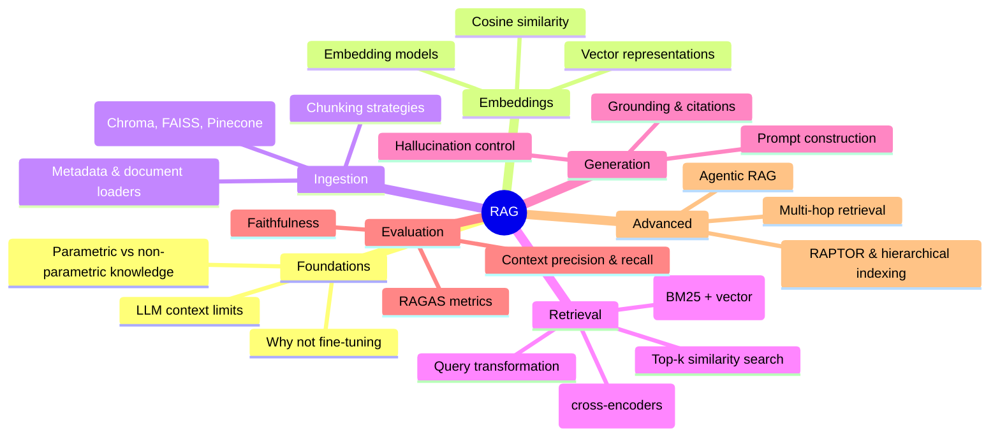

# RAG (Retrieval-Augmented Generation) — Zero to PhD in 10 Days
Daily commitment: 1 hr/day | Total: ~10 hrs | Track: Beginner → Expert

---

## Learning Arc



```
Day 1  Zero → Foundation      "What problem does RAG solve, and why not just fine-tune?"
Day 2  Foundation → Builder   "I understand what an embedding actually is"
Day 3-6 Builder → Practitioner "I can build a working retrieve-then-generate pipeline"
Day 7-9 Practitioner → Expert  "I can improve retrieval quality and prove it with numbers"
Day 10 Expert → PhD            "I can build, defend, and extend a production RAG system"
```

---

## Concept Map



---

## Anchor Resources

| Resource | Type | Link | Why It's the Best |
|----------|------|------|-------------------|
| LangChain Official Docs — RAG tutorial | Docs/tutorial | https://python.langchain.com/docs/tutorials/rag/ | The canonical minimal RAG implementation (~50 lines), version-matched to the library you'll actually use in most jobs. |
| freeCodeCamp — RAG From Scratch (LangChain engineer) | Free video course | https://www.freecodecamp.org/news/mastering-rag-from-scratch/ | Taught by an actual LangChain engineer, covers query translation, routing, and advanced retrieval, not just the toy example. |
| Pinecone Learn — Retrieval Augmented Generation series | Free guide series | https://www.pinecone.io/learn/series/rag/ | Vendor-neutral conceptual depth on embeddings, chunking, and retrieval quality, useful regardless of which vector DB you end up using on the job. |
| DeepLearning.AI — Retrieval Augmented Generation | Free course (audit) | https://www.deeplearning.ai/courses/retrieval-augmented-generation | Andrew Ng's team, hands-on with Weaviate and a real dataset, free to audit on Coursera. Structured, production-lens curriculum. |
| RAGAS Documentation | Docs | https://docs.ragas.io/ | The industry-standard open-source evaluation framework for RAG. Job-ready RAG work means being able to measure faithfulness and context precision, not just eyeball outputs. |

---

## Day-by-Day Plan

### Day 1 — What RAG Solves (and Why Not Just Fine-Tune)

> **Key Insight:** An LLM's knowledge is frozen at training time and can't cite sources. RAG doesn't make the model smarter, it gives the model a fresh, searchable, attributable source of truth at inference time. The shift is from "the model knows the answer" to "the model is handed the answer's source and asked to summarize it."

**Theme:** Understand the problem before touching a vector database.

**Time block (1 hr/day — single block):**
```
Single    ██████████  40 min — Watch + read
Project   ████░░░░░░  20 min — Environment setup
```
**Output:** A working Python environment with an LLM API key (or local model) and embedding library installed, and you can explain why RAG beats fine-tuning for a knowledge-freshness problem.

---

#### Single Block (40 min) — RAG vs Fine-Tuning vs Long Context
**Goal:** Explain, without notes, when you'd reach for RAG instead of fine-tuning or a bigger context window.

**Watch/Read (in this order):**
1. Pinecone Learn — What is Retrieval Augmented Generation? — https://www.pinecone.io/learn/series/rag/ (first article in the series) — read fully (~15 min) — gives you the conceptual frame before any code.
2. LangChain Docs — RAG concepts overview — https://python.langchain.com/docs/concepts/rag/ — skim (~15 min) — this is the vocabulary (retriever, indexing, generation) you'll use for the rest of the course.
3. DeepLearning.AI — RAG course landing page — https://www.deeplearning.ai/courses/retrieval-augmented-generation — read the syllabus/module overview only (~10 min) — orients you to where this 10-day plan is headed at expert level.

**Build:**
- Set up a Python virtual environment. Install `langchain`, `langchain-community`, `chromadb`, and an embeddings provider (OpenAI API, or a free local model via `sentence-transformers` if you want zero API cost).
- Write a 5-line script that calls your chosen LLM directly with a question about a recent, obscure fact it can't know (e.g., something from this week). Observe it either hallucinate or admit it doesn't know. This is the problem RAG fixes.

---

#### End-of-Day Self-Test
- [ ] In one sentence, what does RAG add to an LLM that fine-tuning doesn't?
- [ ] Name one scenario where a bigger context window would be a better fix than RAG.
- [ ] What are the two high-level phases of a RAG pipeline (name them)?

**If you score 2/3 or lower:** Re-read the Pinecone "What is RAG" article's comparison section, then write one sentence each on RAG vs fine-tuning vs long-context before retrying.

**Daily Project:** A script showing your LLM failing to answer a fact it can't know, saved as `day1_the_problem.py`. Done = you have the failure captured and can explain why it happened.

---

### Day 2 — Embeddings and Similarity

> **Key Insight:** An embedding is not a summary, it's a coordinate. Two pieces of text end up close together in vector space if they're used in similar contexts, not because they share words. This is why "How do I reset my password" and "I forgot my login" can be near-neighbors even with zero overlapping vocabulary, and why embedding quality, not just retrieval logic, determines RAG quality.

**Theme:** Understand the representation that everything else in RAG depends on.

```
Single    ██████████  40 min — Watch + read
Project   ████░░░░░░  20 min — Embed and compare text
```
**Output:** A script that embeds several sentences and ranks them by similarity to a query, with results that make intuitive sense to you.

---

#### Single Block (40 min) — Vectors, Cosine Similarity, Embedding Models
**Goal:** Explain cosine similarity in your own words and pick an appropriate embedding model for a given use case.

**Watch/Read:**
1. Pinecone Learn — "What are vector embeddings" article in the RAG series — https://www.pinecone.io/learn/series/rag/ — full read (~20 min).
2. LangChain Docs — Embedding models — https://python.langchain.com/docs/concepts/embedding_models/ — skim, focus on the "which model to choose" guidance (~10 min).
3. freeCodeCamp RAG From Scratch — watch the embeddings/indexing segment only (~10 min) — https://www.freecodecamp.org/news/mastering-rag-from-scratch/

**Build:**
- Embed 5 short sentences (mix of similar and unrelated topics) using your chosen embedding model.
- Compute cosine similarity between a query sentence and all 5, sort by score, and confirm the ranking matches your intuition about which sentences are actually related.

---

#### End-of-Day Self-Test
- [ ] What does cosine similarity actually measure between two vectors?
- [ ] Why can two semantically similar sentences have almost no words in common but still be close in embedding space?
- [ ] Name one tradeoff between a smaller/faster embedding model and a larger/higher-quality one.

**If you score 2/3 or lower:** Redo the similarity exercise with two sentences you predict will confuse the model (same words, different meaning, e.g. "the bank of the river" vs "the bank approved my loan") and inspect the actual scores.

**Daily Project:** `day2_embed_and_rank.py` — embeds a query and 5 candidate sentences, prints them ranked by cosine similarity.

---

### Day 3 — Chunking Strategy

> **Key Insight:** Chunk size is a precision/recall tradeoff, not a technical detail. Chunks too large dilute the embedding with irrelevant content (hurts precision); chunks too small lose surrounding context needed to answer the question (hurts recall). There is no universally correct chunk size, only the right one for your document type and query pattern.

**Theme:** Turn raw documents into retrievable units without destroying their meaning.

```
Single    ██████████  40 min — Watch + read
Project   ████░░░░░░  20 min — Chunk a real document
```
**Output:** A chunked version of a real multi-page document, with a justification for the chunk size and overlap you chose.

---

#### Single Block (40 min) — Fixed, Recursive, and Semantic Chunking
**Goal:** Choose an appropriate chunking strategy and chunk size for a given document type, and explain why.

**Watch/Read:**
1. LangChain Docs — Text splitters — https://python.langchain.com/docs/concepts/text_splitters/ — full read, focus on `RecursiveCharacterTextSplitter` (~20 min).
2. Pinecone Learn — chunking strategies article in the RAG series — https://www.pinecone.io/learn/series/rag/ — read the chunking-specific article (~20 min).

**Build:**
- Take a real document (a PDF, markdown file, or long article, at least 5 pages) and chunk it three ways: fixed-size with no overlap, fixed-size with 20% overlap, and `RecursiveCharacterTextSplitter` respecting paragraph/sentence boundaries.
- Print 2-3 chunks from each strategy side by side and note where the naive fixed-size split cuts a sentence or idea in half versus where the recursive splitter doesn't.

---

#### End-of-Day Self-Test
- [ ] What goes wrong when chunks are too large? What goes wrong when they're too small?
- [ ] Why does chunk overlap help, and what's the cost of using too much of it?
- [ ] What does `RecursiveCharacterTextSplitter` try to preserve that a naive fixed-size split doesn't?

**If you score 2/3 or lower:** Find one chunk in your fixed-size-no-overlap output that clearly cuts a sentence in half, and explain in writing why that would hurt retrieval for a question about that sentence's content.

**Daily Project:** `day3_chunking_comparison.py` plus a short written note on which strategy you'd use for your capstone document and why.

---

### Day 4 — Vector Stores and Indexing

> **Key Insight:** A vector store is not a database of text, it's an index built for approximate nearest-neighbor search over high-dimensional vectors. This is why they support similarity search natively but are often clumsy at exact filters or joins, an expert picks a vector store based on this tradeoff, not brand recognition.

**Theme:** Persist your embeddings somewhere searchable.

```
Single    ██████████  40 min — Watch + read
Project   ████░░░░░░  20 min — Build your first index
```
**Output:** A persisted vector index of your Day 3 document, queryable by similarity search.

---

#### Single Block (40 min) — Indexing, ANN Search, Choosing a Vector Store
**Goal:** Explain approximate nearest-neighbor search at a high level and set up a local vector store.

**Watch/Read:**
1. LangChain Docs — Vector stores — https://python.langchain.com/docs/concepts/vectorstores/ — full read (~20 min).
2. Pinecone Learn — vector indexes article (HNSW, IVF overview) in the RAG series — https://www.pinecone.io/learn/series/rag/ — read for concepts, not implementation details (~20 min) — you need to know these exist and roughly what tradeoff they represent (speed vs recall), not implement them yourself.

**Build:**
- Use Chroma (local, free, no account needed) to build a persisted vector store from your Day 3 chunks.
- Run 3 similarity search queries against it and inspect the returned chunks and their similarity scores.

---

#### End-of-Day Self-Test
- [ ] What does "approximate" mean in approximate nearest-neighbor search, and why accept approximation at all?
- [ ] Name one vector store and one situation where you'd choose it over another (e.g., local dev vs production scale).
- [ ] What metadata would you want to store alongside each chunk's vector, and why?

**If you score 2/3 or lower:** Re-read the HNSW/IVF section of the Pinecone article, then run the same query twice against your Chroma index and confirm the results are consistent (local exact search won't show approximation error, but you should be able to explain where it would show up at scale).

**Daily Project:** `day4_build_index.py` — persists a Chroma index from your Day 3 chunks and runs 3 test queries, with results printed alongside similarity scores.

---

### Day 5 — Retrieval: Turning a Query into Relevant Chunks

> **Key Insight:** Retrieval quality is measured separately from generation quality. If the wrong chunks get retrieved, no prompt engineering downstream can fix the answer, the model can only summarize what it was given. Debugging a bad RAG answer always starts with "what did retrieval actually return," not "what did the prompt say."

**Theme:** Build and inspect the retrieval step in isolation, before adding generation.

```
Single    ██████████  40 min — Watch + read
Project   ████░░░░░░  20 min — Build and inspect a retriever
```
**Output:** A retriever that returns top-k chunks for a query, with a habit of inspecting retrieved chunks before trusting the final answer.

---

#### Single Block (40 min) — Retrievers and Top-k Search
**Goal:** Configure a retriever's `k` value deliberately and explain the precision/recall tradeoff it controls.

**Watch/Read:**
1. LangChain Docs — Retrievers — https://python.langchain.com/docs/concepts/retrievers/ — full read (~20 min).
2. freeCodeCamp RAG From Scratch — watch the retrieval segment (~20 min) — https://www.freecodecamp.org/news/mastering-rag-from-scratch/

**Build:**
- Wrap your Day 4 Chroma index in a LangChain retriever. Query it with 3 different questions about your document and print the top-k (try k=3 and k=8) chunks for each.
- For one query, manually judge whether each retrieved chunk is actually relevant to the question. Calculate your own rough precision (relevant chunks / total retrieved).

---

#### End-of-Day Self-Test
- [ ] Why is it useful to inspect retrieved chunks before looking at the generated answer when debugging a bad RAG response?
- [ ] What happens to precision and recall as you increase k? What's the cost of setting k too high?
- [ ] What does "top-k retrieval" actually return, ranked by what?

**If you score 2/3 or lower:** Take a query where you judged retrieval as poor, and manually trace why: was it a chunking problem (Day 3), an embedding problem (Day 2), or a k-value problem?

**Daily Project:** `day5_retriever_inspection.py` plus a manual precision judgment on one query's retrieved chunks, written down.

---

### Day 6 — The Full Pipeline: Retrieve + Generate

> **Key Insight:** The generation prompt's job is to force the model to answer *only* from the retrieved context, not from its own memory. Without an explicit instruction and structure separating "context" from "question," the model will blend retrieved facts with its own (possibly wrong) prior knowledge, which defeats the purpose of RAG.

**Theme:** Connect retrieval to generation and get a real, grounded answer end to end.

```
Single    ██████████  40 min — Watch + read
Project   ████░░░░░░  20 min — Build the full pipeline
```
**Output:** A working end-to-end RAG pipeline: question in, grounded answer with cited source chunk out.

---

#### Single Block (40 min) — Prompt Construction and Grounding
**Goal:** Write a RAG prompt template that forces the model to answer only from retrieved context and to say "I don't know" when the context doesn't cover the question.

**Watch/Read:**
1. LangChain Docs — RAG tutorial (full implementation) — https://python.langchain.com/docs/tutorials/rag/ — work through it top to bottom, typing the code (~30 min).
2. Pinecone Learn — generation/grounding article in the RAG series — https://www.pinecone.io/learn/series/rag/ — skim for prompt-design guidance (~10 min).

**Build:**
- Wire your Day 5 retriever into a full chain: retrieve top-k chunks, format them into a prompt template with clear "CONTEXT" and "QUESTION" sections, and generate an answer.
- Add an explicit instruction: "If the context doesn't contain the answer, say you don't know." Test it with one question your document actually answers and one it doesn't, and confirm the model behaves correctly on both.

---

#### End-of-Day Self-Test
- [ ] Why does separating "context" and "question" in the prompt matter, rather than just concatenating everything?
- [ ] What happens if you don't explicitly instruct the model to say "I don't know" when context is insufficient?
- [ ] What's the fastest way to tell whether a wrong answer came from bad retrieval or bad generation?

**If you score 2/3 or lower:** Remove the "say I don't know" instruction, re-run the out-of-scope question, and observe the model hallucinate an answer, then add the instruction back and compare.

**Daily Project:** `day6_full_rag_pipeline.py` — complete retrieve-then-generate chain, tested on both an in-scope and an out-of-scope question with visibly different, correct behavior.

---

### Day 7 — Query Transformation

> **Key Insight:** The user's raw question is often a bad search query. RAG systems get a meaningful quality boost by rewriting, expanding, or hypothesizing an answer to the query *before* embedding it for retrieval, because the transformed query is closer in vector space to the document language than the original phrasing was.

**Theme:** Improve retrieval by improving the query, not just the index.

```
Single    ██████████  40 min — Watch + read
Project   ████░░░░░░  20 min — Add a query transform
```
**Output:** A pipeline that rewrites or expands the query before retrieval, with a side-by-side comparison showing improved retrieval on a tricky question.

---

#### Single Block (40 min) — Multi-Query, HyDE, Query Rewriting
**Goal:** Explain what HyDE and multi-query retrieval do differently from naive single-query retrieval, and implement one.

**Watch/Read:**
1. freeCodeCamp RAG From Scratch — watch the query translation segment (multi-query, RAG-Fusion, HyDE) (~25 min) — https://www.freecodecamp.org/news/mastering-rag-from-scratch/
2. LangChain Docs — search "MultiQueryRetriever" in the docs (~15 min) — https://python.langchain.com/docs/how_to/MultiQueryRetriever/

**Build:**
- Pick a vague or awkwardly-phrased question about your document (something a real user might type, not a clean textbook question).
- Implement multi-query retrieval (generate 3 rephrased versions of the question, retrieve for each, merge/deduplicate results) and compare the retrieved chunks against your Day 5 single-query retrieval for the same awkward question.

---

#### End-of-Day Self-Test
- [ ] What does HyDE do differently from multi-query retrieval? (Hint: what gets embedded.)
- [ ] Why would a vague or oddly-phrased user question retrieve worse results than a clean one?
- [ ] What's the cost (in latency or API calls) of adding query transformation to a pipeline?

**If you score 2/3 or lower:** Re-watch the HyDE explanation specifically, then write one sentence on what gets embedded in HyDE that's different from a normal query embedding.

**Daily Project:** `day7_query_transform.py` — multi-query retrieval implementation with a documented before/after comparison on one deliberately awkward question.

---

### Day 8 — Hybrid Search and Reranking

> **Key Insight:** Vector search is bad at exact term matching (product codes, names, acronyms) because embeddings capture meaning, not exact tokens. Hybrid search fixes this by combining vector search with keyword search (BM25) and fusing the results, while reranking is a second, more expensive pass that reorders a larger candidate set using a model that can actually read query and document together, which a single embedding comparison can't do.

**Theme:** Fix the specific failure modes vector-only search has.

```
Single    ██████████  40 min — Watch + read
Project   ████░░░░░░  20 min — Add hybrid search or reranking
```
**Output:** A retrieval step that either combines keyword and vector search, or reranks a larger candidate set, with a documented improvement on a term-heavy query.

---

#### Single Block (40 min) — BM25 + Vector Fusion, Cross-Encoder Reranking
**Goal:** Explain why vector-only search fails on exact-term queries, and how reranking differs mechanically from initial retrieval.

**Watch/Read:**
1. Pinecone Learn — hybrid search article in the RAG series — https://www.pinecone.io/learn/series/rag/ — full read (~20 min).
2. LangChain Docs — search "EnsembleRetriever" (BM25 + vector fusion) — https://python.langchain.com/docs/how_to/ensemble_retriever/ — read and type the example (~20 min).

**Build:**
- Pick a query containing a specific term, code, or name from your document (something exact-match-y). Compare vector-only retrieval against `EnsembleRetriever` (BM25 + vector) on that query, and note whether hybrid search surfaces a chunk vector search missed.
- If time allows, add a simple reranking step (even a basic score-based reorder using a cross-encoder from `sentence-transformers` counts) on your top-10 candidates and compare the new top-3 to the un-reranked top-3.

---

#### End-of-Day Self-Test
- [ ] Why does pure vector search struggle with exact terms like product codes or names?
- [ ] What does Reciprocal Rank Fusion do when combining BM25 and vector search results?
- [ ] What's structurally different about how a reranker scores a document compared to how the initial embedding similarity does?

**If you score 2/3 or lower:** Re-run your exact-term query with vector-only search and hybrid search side by side, and write one sentence pinpointing exactly which chunk hybrid search added that vector-only missed.

**Daily Project:** `day8_hybrid_and_rerank.py` with a documented before/after comparison on one term-heavy query.

---

### Day 9 — Evaluation: Proving Your RAG System Works

> **Key Insight:** "It looks right" is not evaluation. Faithfulness (does the answer only contain claims supported by the retrieved context) and context precision/recall (did retrieval get the right chunks, and only the right chunks) are separately measurable, and a RAG system can fail at one while succeeding at the other. Job-ready RAG work means you can point to a number, not a vibe.

**Theme:** Measure what you built instead of eyeballing it.

```
Single    ██████████  40 min — Watch + read
Project   ████░░░░░░  20 min — Run a real evaluation
```
**Output:** RAGAS scores (faithfulness, answer relevancy, context precision) for your pipeline on a small test set you wrote yourself.

---

#### Single Block (40 min) — RAGAS Metrics
**Goal:** Explain what faithfulness, answer relevancy, and context precision/recall each measure, and what a low score in each one tells you to go fix.

**Watch/Read:**
1. RAGAS Docs — Core concepts / metrics overview — https://docs.ragas.io/en/stable/concepts/metrics/overview/ — full read (~25 min).
2. RAGAS Docs — Quickstart — https://docs.ragas.io/en/stable/getstarted/ — follow along, type the code (~15 min).

**Build:**
- Write a small evaluation set: 5 question/expected-answer pairs about your document.
- Run your Day 6-8 pipeline against RAGAS and get faithfulness, answer relevancy, and context precision scores. Identify your single weakest metric and write one sentence on which earlier day's work (chunking, retrieval, generation) is the likely cause.

---

#### End-of-Day Self-Test
- [ ] If faithfulness is low but context precision is high, what's most likely broken, retrieval or generation?
- [ ] If context recall is low, what does that tell you about your chunking or retriever's k value?
- [ ] Why is a hand-written eval set of 5 questions more useful right now than a generic benchmark dataset?

**If you score 2/3 or lower:** Pick your single worst-scoring question, manually inspect the retrieved chunks and generated answer for it, and identify the exact point of failure before moving on.

**Daily Project:** `day9_ragas_eval.py` plus a written note: your weakest metric, and a specific fix you'd make (not a vague "improve retrieval").

---

### Day 10 — Capstone: Build and Defend a Production RAG System

> **Key Insight:** PhD-level means you can justify every design decision when someone pushes back, not just make the pipeline return an answer. Today isn't new material, it's synthesis: proving you can build something end to end and explain why you built it that way, the way you would in a technical interview.

**Theme:** Prove you can build something end to end and defend the design.

```
Single    ██████████  20 min — Plan
Project   ██████████  40 min — Build the capstone
```
**Output:** A complete, portfolio-ready RAG system plus a one-paragraph design justification and your RAGAS scores.

---

#### Single Block (20 min) — Plan Before You Build
**Goal:** Decide your document set, chunking strategy, and retrieval design before writing code, practicing the design step, not just the coding step.

**Watch/Read:**
1. Re-skim your own Day 1-9 project notes (10 min) — no new external resource today; the point is synthesis, not new input.
2. Pinecone Learn — production RAG best practices article in the series (~10 min) — https://www.pinecone.io/learn/series/rag/ — sanity-check your design against production guidance.

**Build:**
- Sketch the capstone pipeline (see below) before opening your editor: which chunking strategy, which retrieval method, whether you're adding reranking, and how you'll evaluate it.

---

## Capstone Project

**Project:** Grounded Q&A System Over a Real Multi-Document Corpus
**What it does:** A RAG system over at least 3 real documents (your choice: your own resume + cover letters, a technical spec, a set of articles) that retrieves with hybrid search, optionally reranks, generates grounded answers with source citations, refuses to answer out-of-scope questions, and reports RAGAS scores.
**Why it matters:** This combination — hybrid retrieval, grounded generation, explicit refusal, measured evaluation — is what separates a demo from a system a hiring manager would trust in production, and directly demonstrates the AI Engineer skill set.
**Skills it demonstrates:**
- Chunking strategy selection and justification
- Vector store indexing
- Hybrid search (BM25 + vector) and optionally reranking
- Query transformation for hard questions
- Grounded prompt construction with explicit refusal behavior
- RAGAS-based evaluation and metric-driven debugging
**Time to build:** 1 hour (spread across Day 10's block plus buffer)
**Steps:**
1. Chunk your chosen multi-document corpus using the strategy you justified on Day 3.
2. Build a Chroma index and wrap it in a hybrid (BM25 + vector) `EnsembleRetriever`.
3. Add source citation to the generation prompt (require the model to reference which document/chunk it used).
4. Test with 3 in-scope questions and 1 deliberately out-of-scope question, confirm correct refusal behavior on the latter.
5. Write a 5-question RAGAS eval set and run it, capturing faithfulness, answer relevancy, and context precision scores.
6. Write a one-paragraph design justification: why this chunk size, why hybrid search, what your weakest metric was and why.
**Stretch goal:** Add a query transformation step (multi-query or HyDE) specifically for the questions that scored lowest on context precision, and re-run RAGAS to measure the improvement quantitatively.

---

## Common Traps

**Trap 1: Chunking without testing retrieval on real questions**
What happens: A beginner picks a chunk size that "seems reasonable" and never validates it against actual queries, then can't explain why retrieval is weak.
Why: Chunk size feels like a technical parameter, not something to test empirically, so it gets set once and ignored.
Fix: Always run 3-5 real test questions against retrieval before moving on, and re-chunk if the right chunk isn't in the top-k.

**Trap 2: Trusting the generated answer without inspecting retrieved chunks**
What happens: The final answer looks plausible, so the beginner assumes retrieval worked, when actually the model quietly filled a gap with its own prior knowledge.
Why: Fluent generation hides retrieval failure; a wrong-but-confident answer looks identical to a right one at a glance.
Fix: Make it a habit to print and read retrieved chunks alongside every generated answer during development, not just in production debugging.

**Trap 3: No explicit "don't know" instruction in the prompt**
What happens: The model answers questions the retrieved context doesn't actually cover, by falling back on its own training data, silently defeating the point of RAG.
Why: A generic "answer the question using this context" prompt doesn't forbid using outside knowledge, it just suggests using the context.
Fix: Explicitly instruct the model to say it doesn't know when context is insufficient, and test this behavior on purpose with an out-of-scope question.

**Trap 4: Using vector search alone for exact-term queries**
What happens: A query containing a specific product code, name, or acronym returns semantically related but factually wrong chunks.
Why: Embeddings capture meaning, not exact tokens, so an exact string can be embedded near many unrelated but topically similar texts.
Fix: Add BM25/keyword search as part of a hybrid retrieval strategy for any domain where exact terms matter (which is most real domains).

**Trap 5: Treating evaluation as optional or "eyeballing it"**
What happens: A RAG system that looks fine on 2-3 manually checked examples turns out to fail broadly once measured, because the manually checked examples happened to be easy.
Why: A small number of hand-picked spot checks is not statistically meaningful and is biased toward questions the builder already expects to work.
Fix: Build even a small (5-10 question) RAGAS eval set early and rerun it after every significant change, so you catch regressions instead of assuming improvement.

---

## PhD Depth Track

| Resource | Level | Link | What you will learn that the main plan does not cover |
|----------|-------|------|------------------------------------------------------|
| freeCodeCamp RAG From Scratch — advanced segments (routing, RAPTOR, ColBERT, CRAG, Adaptive RAG) | Advanced | https://www.freecodecamp.org/news/mastering-rag-from-scratch/ | Hierarchical indexing (RAPTOR), token-level retrieval (ColBERT), and self-correcting RAG (CRAG), well beyond a standard retrieve-then-generate pipeline. |
| DeepLearning.AI — Building Agentic RAG with LlamaIndex | Advanced / free course | https://www.deeplearning.ai/short-courses/building-agentic-rag-with-llamaindex/ | Multi-step, tool-using RAG agents that decide when and what to retrieve, rather than a fixed single retrieval step. |
| RAGAS Docs — Custom metrics and test set generation | Advanced | https://docs.ragas.io/en/stable/ | Synthetic test set generation at scale and writing your own domain-specific evaluation metrics, beyond the standard four. |
| Pinecone Learn — full RAG series (remaining advanced articles) | Advanced | https://www.pinecone.io/learn/series/rag/ | Production-scale considerations: latency budgets, cost tradeoffs, and index maintenance at millions of vectors. |
| DeepLearning.AI — Retrieval Augmented Generation (full course, Weaviate) | Advanced / free (audit) | https://www.deeplearning.ai/courses/retrieval-augmented-generation | Structured, production-lens curriculum on a real news dataset at scale, the natural next step after this 10-day plan. |

---

## Confidence Test

**The Challenge:** Without looking at your notes, build a RAG system from scratch in under 90 minutes over a new document set (not one you've used this week) that: chunks appropriately, uses hybrid search, generates a grounded answer with a citation, correctly refuses one deliberately out-of-scope question, and reports RAGAS faithfulness and context precision scores.

**You pass if:**
- [ ] The system produces grounded, cited answers on in-scope questions and correctly refuses the out-of-scope one, with no reference to prior notes during the build
- [ ] You can verbally explain, without hesitation, why you chose your chunk size and retrieval strategy for this specific document set
- [ ] Your RAGAS faithfulness score is reported and you can explain what a low score would have told you to fix

**Time limit:** 90 minutes
